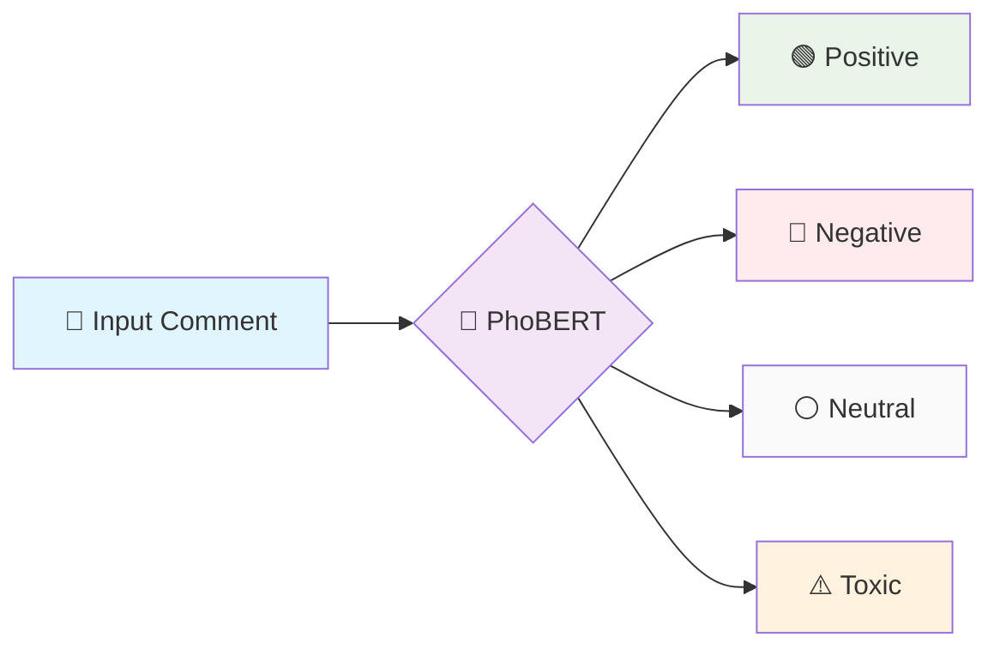
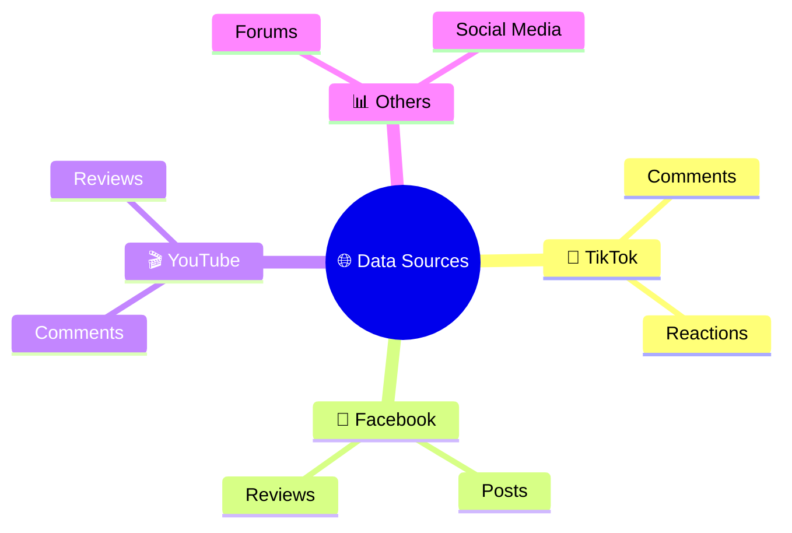
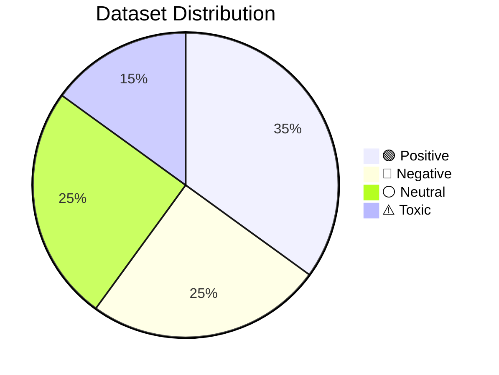
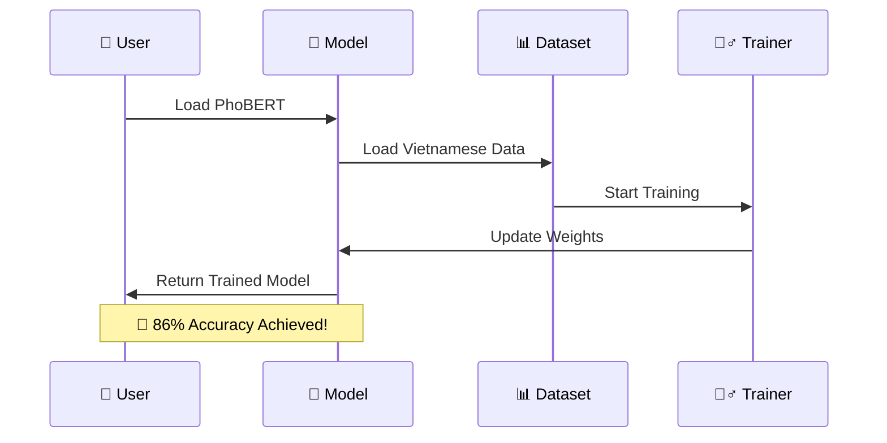
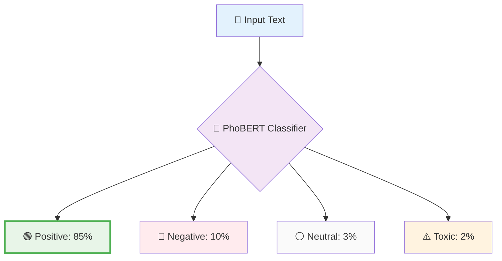
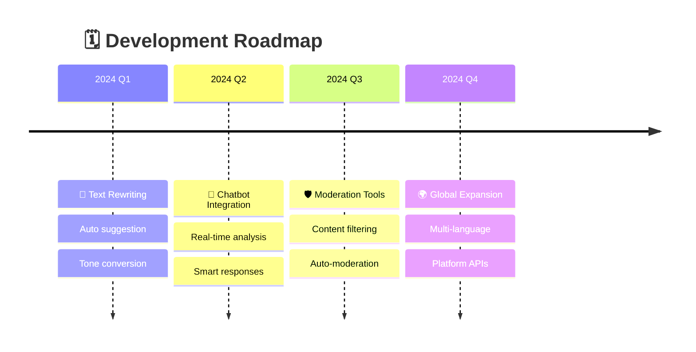
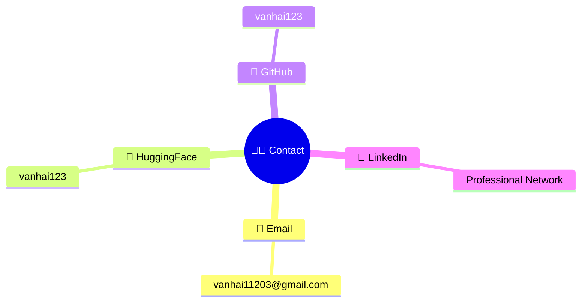

<div align="center">


</div>

# <div align="center">🚀 PhoBERT Comment Classifier</div>
### <div align="center">*Mô hình phân loại cảm xúc bình luận tiếng Việt thông minh*</div>

<div align="center">


[](https://huggingface.co/vanhai123/phobert-vi-comment-4class)
[](https://huggingface.co/datasets/vanhai123/vietnamese-social-comments)
[](https://huggingface.co/spaces/vanhai123/phobert-vi-comment-app)


</div>

---

<div align="center">


</div>

## 🎯 **Tổng quan dự án**

> 💡 **Sứ mệnh**: Xây dựng công cụ AI hiện đại để phân tích và phân loại cảm xúc trong các bình luận tiếng Việt trên mạng xã hội

<div align="center">
  


</div>

<table>
<tr>
<td width="50%">

### 🎭 **Khả năng phân loại**
<div align="center">



- 🟢 **Positive** - Tích cực
- 🔴 **Negative** - Tiêu cực  
- ⚪ **Neutral** - Trung lập
- ⚠️ **Toxic** - Kích động, phản cảm

</div>
</td>
<td width="50%">

### 📱 **Nguồn dữ liệu**
<div align="center">



- 🎵 TikTok Comments
- 📘 Facebook Posts
- 🎬 YouTube Reviews
- 🌐 Các platform khác

</div>
</td>
</tr>
</table>

---

## 📊 **Thông tin Dataset**

<div align="center">


| 📈 **Metric** | 📋 **Value** | 🎯 **Description** |
|:-------------:|:------------:|:-------------------|
| **📝 Comments** | `4,896` | Tổng số bình luận được thu thập |
| **🏷️ Labels** | `4 classes` | positive, negative, neutral, toxic |
| **🌐 Sources** | `Multi-platform` | TikTok, Facebook, YouTube |
| **📊 Fields** | `3 columns` | comment, label, category |

</div>

<div align="center">



</div>

<details>
<summary>🔍 <strong>Chi tiết phân bố dữ liệu</strong></summary>

```
📊 Label Distribution:
├── 🟢 Positive: ~35%
├── 🔴 Negative: ~25% 
├── ⚪ Neutral:  ~25%
└── ⚠️ Toxic:    ~15%
```

</details>

---

## ⚡ **Cài đặt nhanh**

### 🛠️ **Requirements**

```bash
# 📦 Cài đặt các thư viện cần thiết
pip install transformers datasets scikit-learn sentencepiece torch
```

<details>
<summary>💻 <strong>Chi tiết dependencies</strong></summary>

```txt
transformers>=4.21.0
datasets>=2.4.0
scikit-learn>=1.1.0
sentencepiece>=0.1.97
torch>=1.12.0
gradio>=3.0.0  # Cho demo app
```

</details>

---

## 🏗️ **Hướng dẫn Training**

<div align="center">


</div>

### 🚀 **Quick Start**



```python
from transformers import AutoTokenizer, AutoModelForSequenceClassification

# 🔧 Khởi tạo model và tokenizer
model_name = "vinai/phobert-base"
tokenizer = AutoTokenizer.from_pretrained(model_name)
model = AutoModelForSequenceClassification.from_pretrained(
    model_name, 
    num_labels=4
)
```

### 📋 **Training Process**

<table>
<tr>
<td width="50%">

**🎯 Bước 1: Chuẩn bị**
```python
# Load dataset
from datasets import load_dataset
dataset = load_dataset("vanhai123/vietnamese-social-comments")
```

</td>
<td width="50%">

**🏃‍♂️ Bước 2: Training**
```python
# Chạy training script
python train.py
# hoặc sử dụng notebook
jupyter notebook train.ipynb
```

</td>
</tr>
</table>

---

## 📈 **Kết quả Performance**

<div align="center">


### 🏆 **Model Performance**

| 📊 **Metric** | 📈 **Score** | 🎯 **Details** |
|:-------------:|:------------:|:---------------|
| **🎯 Accuracy** | `~86%` | Độ chính xác tổng thể |
| **📊 Macro F1** | `~83%` | F1-score trung bình |
| **🟢 Best Class** | `Positive` | Phân loại tốt nhất |
| **⚠️ Strong Class** | `Toxic` | Nhận diện tốt nội dung độc hại |

```mermaid
gantt
    title 📊 Model Performance Timeline
    dateFormat  X
    axisFormat %s
    
    section Positive
    Precision    :0, 89
    Recall       :0, 91
    F1-Score     :0, 90
    
    section Negative
    Precision    :0, 84
    Recall       :0, 82
    F1-Score     :0, 83
    
    section Neutral
    Precision    :0, 81
    Recall       :0, 79
    F1-Score     :0, 80
    
    section Toxic
    Precision    :0, 88
    Recall       :0, 86
    F1-Score     :0, 87
```

</div>

<div align="center">



</div>

### 📊 **Detailed Results**

```
🎭 Classification Performance:
┌─────────────┬─────────────┬─────────────┬─────────────┐
│   Class     │ Precision   │   Recall    │   F1-Score  │
├─────────────┼─────────────┼─────────────┼─────────────┤
│ 🟢 Positive │    0.89     │    0.91     │    0.90     │
│ 🔴 Negative │    0.84     │    0.82     │    0.83     │
│ ⚪ Neutral  │    0.81     │    0.79     │    0.80     │
│ ⚠️ Toxic    │    0.88     │    0.86     │    0.87     │
└─────────────┴─────────────┴─────────────┴─────────────┘
```

---

## 🔮 **Demo & Usage**

<div align="center">


### 🎮 **Interactive Demo**

[](https://huggingface.co/spaces/vanhai123/phobert-vi-comment-app)

</div>

<div align="center">



</div>

### 💻 **Code Example**

```python
from transformers import pipeline

# 🚀 Khởi tạo pipeline
classifier = pipeline(
    "text-classification", 
    model="vanhai123/phobert-vi-comment-4class"
)

# 🔍 Phân loại bình luận
result = classifier("Tôi không đồng ý với quan điểm này")
print(f"📊 Kết quả: {result}")

# 🎯 Ví dụ nhiều câu
comments = [
    "Sản phẩm này rất tuyệt vời!",
    "Tôi không hài lòng với dịch vụ",
    "Bình thường thôi, không có gì đặc biệt",
    "Đồ rác, ai mua là ngu!"
]

for comment in comments:
    result = classifier(comment)
    print(f"💬 '{comment}' → {result[0]['label']} ({result[0]['score']:.2%})")
```

---

## 🌟 **Roadmap & Extensions**

<div align="center">


### 🚀 **Planned Features**

</div>

<div align="center">



</div>

<table>
<tr>
<td width="33%">

**🔄 Text Rewriting**
- Tự động gợi ý viết lại
- Chuyển đổi tone
- Cải thiện văn phong

</td>
<td width="33%">

**🤖 Chatbot Integration**
- Tích hợp vào chatbot
- Real-time analysis
- Smart responses

</td>
<td width="33%">

**🛡️ Moderation Tools**
- Content filtering
- Auto-moderation
- Platform integration

</td>
</tr>
</table>

### 🎯 **Future Enhancements**

- [ ] 🌐 **Multi-platform API**
- [ ] 📱 **Mobile SDK**
- [ ] 🔄 **Real-time streaming**
- [ ] 📊 **Advanced analytics**
- [ ] 🌍 **Multi-language support**
- [ ] 🧠 **Emotion detection**

---

## 🤝 **Contributing**

<div align="center">

### 💝 **Đóng góp cho dự án**

[](https://github.com/vanhai123/phobert-comment-classifier/issues)

</div>

```bash
# 🍴 Fork repository
git clone https://github.com/vanhai123/phobert-comment-classifier.git

# 🌿 Tạo branch mới
git checkout -b feature/amazing-feature

# 💾 Commit changes
git commit -m "✨ Add amazing feature"

# 🚀 Push to branch
git push origin feature/amazing-feature

# 🔄 Open Pull Request
```

---

## 📞 **Liên hệ & Hỗ trợ**

<div align="center">


### 👨‍💻 **Tác giả: Hà Văn Hải**

<table>
<tr>
<td align="center">

<br>
<sub><b>🇻🇳 AI Researcher</b></sub>
</td>
<td align="center">



</td>
</tr>
</table>

[](mailto:vanhai11203@gmail.com)
[](https://huggingface.co/vanhai123)
[](https://github.com/vanhai123)


</div>

---

## 📄 **License & Citation**

<details>
<summary>📜 <strong>MIT License</strong></summary>

```
MIT License

Copyright (c) 2024 Hà Văn Hải

Permission is hereby granted, free of charge, to any person obtaining a copy
of this software and associated documentation files (the "Software"), to deal
in the Software without restriction, including without limitation the rights
to use, copy, modify, merge, publish, distribute, sublicense, and/or sell
copies of the Software, and to permit persons to whom the Software is
furnished to do so, subject to the following conditions:

The above copyright notice and this permission notice shall be included in all
copies or substantial portions of the Software.
```

</details>

### 📚 **Citation**

```bibtex
@misc{phobert-vi-comment-classifier,
  title={PhoBERT Vietnamese Comment Classifier},
  author={Hà Văn Hải},
  year={2024},
  publisher={Hugging Face},
  url={https://huggingface.co/vanhai123/phobert-vi-comment-4class}
}
```

---

<div align="center">

### 🌟 **Star History**

[](https://star-history.com/#vanhai123/phobert-comment-classifier&Date)


---

**⭐ Nếu project hữu ích, đừng quên cho một star nhé! ⭐**

<div align="center">


</div>


</div>

---

> ✨ **Được phát triển với ❤️ sử dụng Hugging Face Transformers & PhoBERT trên dữ liệu tiếng Việt thực tế**
