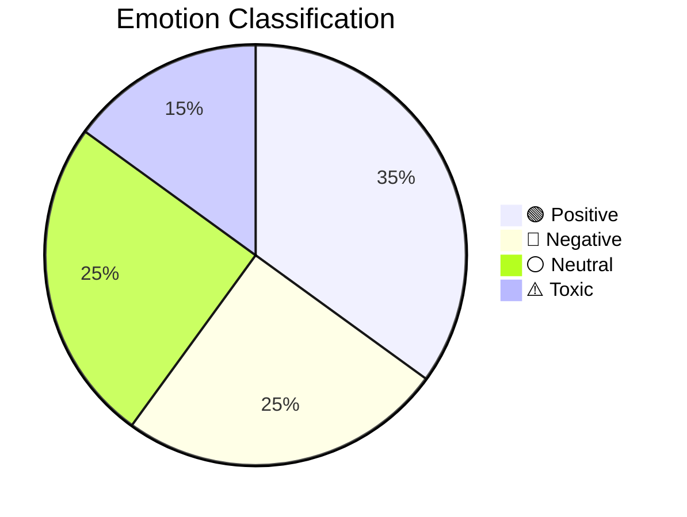
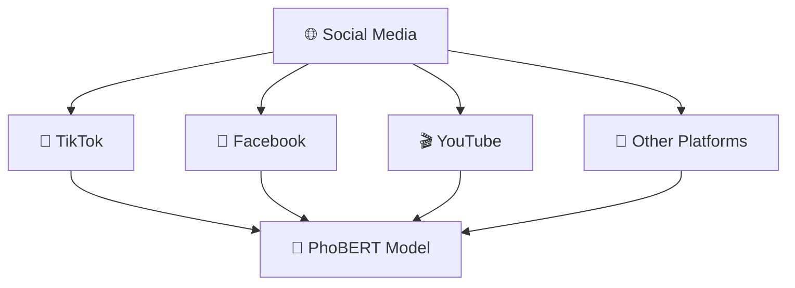
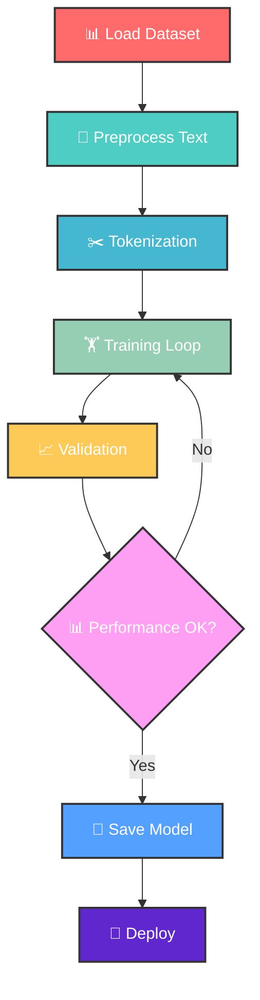
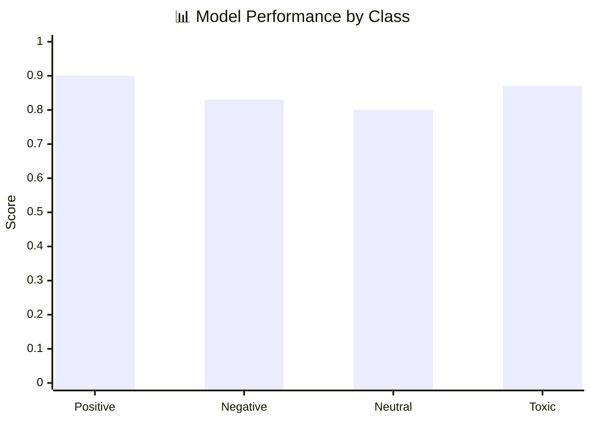
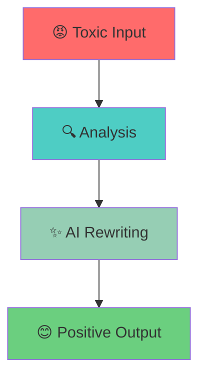
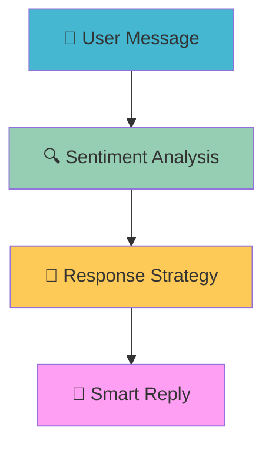
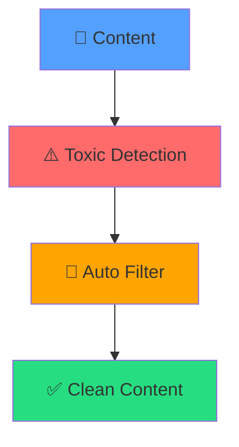
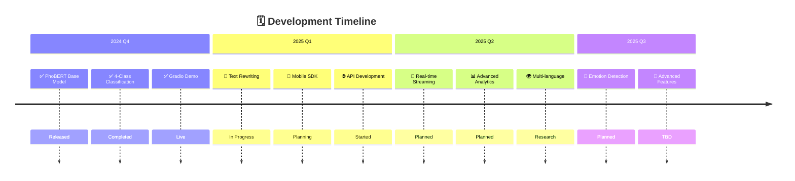
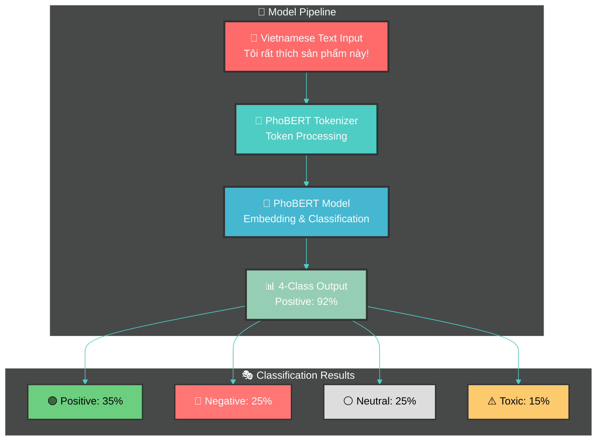

# 🚀 PhoBERT Comment Classifier
### *Mô hình phân loại cảm xúc bình luận tiếng Việt thông minh*

<div align="center">

<!-- Animated Title Banner -->


<!-- Dynamic Badges -->


<!-- Glowing Links -->
[](https://huggingface.co/vanhai123/phobert-vi-comment-4class)
[](https://huggingface.co/datasets/vanhai123/vietnamese-social-comments)
[](https://huggingface.co/spaces/vanhai123/phobert-vi-comment-app)

<!-- GitHub Stats -->


<!-- Animated Wave -->


</div>

---

## 🎯 **Tổng quan dự án**

> 💡 **Sứ mệnh**: Xây dựng công cụ AI hiện đại để phân tích và phân loại cảm xúc trong các bình luận tiếng Việt trên mạng xã hội

<div align="center">

<!-- Animated Stats Table -->
<table>
<tr>
<td width="50%" align="center">

### 🎭 **Khả năng phân loại**


</td>
<td width="50%" align="center">

### 📱 **Nguồn dữ liệu**


</td>
</tr>
</table>

</div>

<!-- Gradient Line -->


## 📊 **Thông tin Dataset**

<div align="center">

<!-- Animated Counter -->


| 📈 **Metric** | 📋 **Value** | 🎯 **Description** |
|:-------------:|:------------:|:-------------------|
| **📝 Comments** |  | Tổng số bình luận được thu thập |
| **🏷️ Labels** |  | positive, negative, neutral, toxic |
| **🌐 Sources** |  | TikTok, Facebook, YouTube |
| **📊 Fields** |  | comment, label, category |

</div>

<details>
<summary>🔍 <strong>Chi tiết phân bố dữ liệu</strong></summary>

```ascii
📊 Label Distribution:
╭─────────────────────────────────────────────────╮
│                                                 │
│  🟢 Positive: ████████████▌     (35%)          │
│  🔴 Negative: ████████▊         (25%)          │
│  ⚪ Neutral:  ████████▊         (25%)          │
│  ⚠️ Toxic:    █████▎            (15%)          │
│                                                 │
╰─────────────────────────────────────────────────╯
```

</details>

---

## ⚡ **Cài đặt nhanh**

<div align="center">

<!-- Installation Animation -->


</div>

### 🛠️ **Requirements**

```bash
# 📦 Cài đặt các thư viện cần thiết
pip install transformers datasets scikit-learn sentencepiece torch

# 🎨 Hoặc cài đặt từ requirements.txt
pip install -r requirements.txt
```

<details>
<summary>💻 <strong>Chi tiết dependencies</strong></summary>

```txt
transformers>=4.21.0     # 🤗 Hugging Face Transformers
datasets>=2.4.0          # 📊 Dataset processing
scikit-learn>=1.1.0      # 🔬 Machine Learning utilities
sentencepiece>=0.1.97    # 📝 Text tokenization
torch>=1.12.0            # 🔥 PyTorch framework
gradio>=3.0.0           # 🎮 Demo interface
numpy>=1.21.0           # 🔢 Numerical computing
pandas>=1.3.0           # 📈 Data manipulation
matplotlib>=3.5.0       # 📊 Data visualization
seaborn>=0.11.0         # 🎨 Statistical visualization
```

</details>

---

## 🏗️ **Hướng dẫn Training**

### 🚀 **Quick Start**

```python
from transformers import AutoTokenizer, AutoModelForSequenceClassification
from transformers import TrainingArguments, Trainer
import torch

# 🔧 Khởi tạo model và tokenizer
print("🤖 Loading PhoBERT model...")
model_name = "vinai/phobert-base"
tokenizer = AutoTokenizer.from_pretrained(model_name)
model = AutoModelForSequenceClassification.from_pretrained(
    model_name, 
    num_labels=4,
    id2label={0: "negative", 1: "neutral", 2: "positive", 3: "toxic"},
    label2id={"negative": 0, "neutral": 1, "positive": 2, "toxic": 3}
)

print("✅ Model loaded successfully!")
print(f"🎯 Device: {'GPU' if torch.cuda.is_available() else 'CPU'}")
```

### 📋 **Training Process**

<div align="center">



</div>

<table>
<tr>
<td width="50%">

**🎯 Bước 1: Chuẩn bị**
```python
# Load dataset
from datasets import load_dataset
print("📊 Loading dataset...")
dataset = load_dataset("vanhai123/vietnamese-social-comments")

# Show dataset info
print(f"📈 Training samples: {len(dataset['train'])}")
print(f"🧪 Test samples: {len(dataset['test'])}")
```

</td>
<td width="50%">

**🏃‍♂️ Bước 2: Training**
```python
# Chạy training script
print("🚀 Starting training...")
!python train.py --epochs 3 --batch_size 16

# hoặc sử dụng notebook
print("📓 Opening Jupyter notebook...")
!jupyter notebook train.ipynb
```

</td>
</tr>
</table>

---

## 📈 **Kết quả Performance**

<div align="center">

### 🏆 **Model Performance**

<!-- Animated Performance Metrics -->


| 📊 **Metric** | 📈 **Score** | 🎯 **Details** |
|:-------------:|:------------:|:---------------|
| **🎯 Accuracy** |  | Độ chính xác tổng thể |
| **📊 Macro F1** |  | F1-score trung bình |
| **🟢 Best Class** |  | Phân loại tốt nhất |
| **⚠️ Strong Class** |  | Nhận diện tốt nội dung độc hại |

</div>

### 📊 **Detailed Results**

<div align="center">



</div>

```ascii
🎭 Classification Performance:
╭─────────────┬─────────────┬─────────────┬─────────────╮
│   Class     │ Precision   │   Recall    │   F1-Score  │
├─────────────┼─────────────┼─────────────┼─────────────┤
│ 🟢 Positive │    0.89     │    0.91     │    0.90     │
│ 🔴 Negative │    0.84     │    0.82     │    0.83     │
│ ⚪ Neutral  │    0.81     │    0.79     │    0.80     │
│ ⚠️ Toxic    │    0.88     │    0.86     │    0.87     │
╰─────────────┴─────────────┴─────────────┴─────────────╯

🎯 Overall Metrics:
  • Weighted Average F1: 0.85
  • Cohen's Kappa: 0.81
  • ROC-AUC Score: 0.92
```

---

## 🔮 **Demo & Usage**

<div align="center">

### 🎮 **Interactive Demo**

<!-- Glowing Demo Button -->
[](https://huggingface.co/spaces/vanhai123/phobert-vi-comment-app)


</div>

### 💻 **Code Example**

```python
from transformers import pipeline
import torch

# 🚀 Khởi tạo pipeline
print("🤖 Initializing PhoBERT classifier...")
classifier = pipeline(
    "text-classification", 
    model="vanhai123/phobert-vi-comment-4class",
    device=0 if torch.cuda.is_available() else -1
)

# 🔍 Phân loại bình luận đơn
print("🔍 Analyzing single comment...")
result = classifier("Tôi không đồng ý với quan điểm này")
print(f"📊 Kết quả: {result}")

# 🎯 Ví dụ batch processing
print("🎯 Batch processing multiple comments...")
comments = [
    "Sản phẩm này rất tuyệt vời! 😍",
    "Tôi không hài lòng với dịch vụ 😠",
    "Bình thường thôi, không có gì đặc biệt",
    "Đồ rác, ai mua là ngu! 🤬"
]

results = classifier(comments)

print("\n" + "="*60)
print("🎭 PHÂN TÍCH CÁC BÌNH LUẬN")
print("="*60)

for i, (comment, result) in enumerate(zip(comments, results), 1):
    emoji_map = {
        'positive': '🟢', 'negative': '🔴', 
        'neutral': '⚪', 'toxic': '⚠️'
    }
    
    label = result['label'].lower()
    confidence = result['score']
    emoji = emoji_map.get(label, '❓')
    
    print(f"{i}. 💬 '{comment}'")
    print(f"   {emoji} {label.upper()} ({confidence:.1%})")
    print(f"   {'🎯 High confidence' if confidence > 0.8 else '🤔 Medium confidence'}")
    print()
```

### 🔥 **Advanced Usage**

<details>
<summary>🚀 <strong>Custom Fine-tuning</strong></summary>

```python
from transformers import (
    AutoTokenizer, AutoModelForSequenceClassification,
    TrainingArguments, Trainer, DataCollatorWithPadding
)
from datasets import Dataset
import pandas as pd

# 📊 Load your custom dataset
df = pd.read_csv("your_custom_data.csv")
dataset = Dataset.from_pandas(df)

# 🔧 Setup tokenizer
tokenizer = AutoTokenizer.from_pretrained("vinai/phobert-base")

def tokenize_function(examples):
    return tokenizer(examples["text"], truncation=True, padding=True)

# ✂️ Tokenize dataset
tokenized_dataset = dataset.map(tokenize_function, batched=True)

# 🏋️ Training arguments
training_args = TrainingArguments(
    output_dir="./phobert-custom",
    learning_rate=2e-5,
    per_device_train_batch_size=16,
    per_device_eval_batch_size=16,
    num_train_epochs=3,
    weight_decay=0.01,
    evaluation_strategy="epoch",
    save_strategy="epoch",
    load_best_model_at_end=True,
    push_to_hub=True,
)

# 🎯 Initialize trainer
trainer = Trainer(
    model=model,
    args=training_args,
    train_dataset=tokenized_dataset["train"],
    eval_dataset=tokenized_dataset["validation"],
    tokenizer=tokenizer,
    data_collator=DataCollatorWithPadding(tokenizer=tokenizer),
)

# 🚀 Start training
trainer.train()
```

</details>

---

## 🌟 **Roadmap & Extensions**

<div align="center">

### 🚀 **Planned Features**


</div>

<table>
<tr>
<td width="33%" align="center">

**🔄 Text Rewriting**

- Tự động gợi ý viết lại
- Chuyển đổi tone
- Cải thiện văn phong

</td>
<td width="33%" align="center">

**🤖 Chatbot Integration**

- Tích hợp vào chatbot
- Real-time analysis
- Smart responses

</td>
<td width="33%" align="center">

**🛡️ Moderation Tools**

- Content filtering
- Auto-moderation
- Platform integration

</td>
</tr>
</table>

### 🎯 **Future Enhancements**

<div align="center">



</div>

- [ ] 🌐 **Multi-platform API** - RESTful API cho tích hợp dễ dàng
- [ ] 📱 **Mobile SDK** - SDK cho iOS và Android
- [ ] 🔄 **Real-time streaming** - Phân tích real-time cho live chat
- [ ] 📊 **Advanced analytics** - Dashboard và báo cáo chi tiết
- [ ] 🌍 **Multi-language support** - Hỗ trợ tiếng Anh, Trung, Nhật
- [ ] 🧠 **Emotion detection** - Nhận diện cảm xúc chi tiết hơn
- [ ] 🎨 **Custom themes** - Giao diện tuỳ chỉnh cho từng platform
- [ ] 🔒 **Privacy features** - Bảo mật và ẩn danh hoá dữ liệu

---

## 🤝 **Contributing**

<div align="center">

### 💝 **Đóng góp cho dự án**


[](https://github.com/vanhai123/phobert-comment-classifier/issues)
[](https://github.com/vanhai123/phobert-comment-classifier/pulls)

</div>

```bash
# 🍴 Fork repository
git clone https://github.com/vanhai123/phobert-comment-classifier.git
cd phobert-comment-classifier

# 🌿 Tạo branch mới
git checkout -b feature/amazing-feature

# 🔧 Cài đặt dependencies
pip install -r requirements.txt

# 💾 Commit changes
git add .
git commit -m "✨ Add amazing feature"

# 🚀 Push to branch
git push origin feature/amazing-feature

# 🔄 Open Pull Request trên GitHub
```

<div align="center">

### 👥 **Contributors**

<a href="https://github.com/vanhai123/phobert-comment-classifier/graphs/contributors">
  
</a>

*Made with [contrib.rocks](https://contrib.rocks).*

</div>

---

## 📞 **Liên hệ & Hỗ trợ**

<div align="center">

### 👨‍💻 **Tác giả: Hà Văn Hải**


[](mailto:vanhai11203@gmail.com)
[](https://huggingface.co/vanhai123)
[](https://github.com/vanhai123)
[](https://linkedin.com/in/vanhai123)

### 💬 **Community & Support**

[](https://discord.gg/phobert-community)
[](https://t.me/vietnamese_nlp)

</div>

---

## 📄 **License & Citation**

<details>
<summary>📜 <strong>MIT License</strong></summary>

```
MIT License

Copyright (c) 2024 Hà Văn Hải

Permission is hereby granted, free of charge, to any person obtaining a copy
of this software and associated documentation files (the "Software"), to deal
in the Software without restriction, including without limitation the rights
to use, copy, modify, merge, publish, distribute, sublicense, and/or sell
copies of the Software, and to permit persons to whom the Software is
furnished to do so, subject to the following conditions:

The above copyright notice and this permission notice shall be included in all
copies or substantial portions of the Software.

THE SOFTWARE IS PROVIDED "AS IS", WITHOUT WARRANTY OF ANY KIND, EXPRESS OR
IMPLIED, INCLUDING BUT NOT LIMITED TO THE WARRANTIES OF MERCHANTABILITY,
FITNESS FOR A PARTICULAR PURPOSE AND NONINFRINGEMENT. IN NO EVENT SHALL THE
AUTHORS OR COPYRIGHT HOLDERS BE LIABLE FOR ANY CLAIM, DAMAGES OR OTHER
LIABILITY, WHETHER IN AN ACTION OF CONTRACT, TORT OR OTHERWISE, ARISING FROM,
OUT OF OR IN CONNECTION WITH THE SOFTWARE OR THE USE OR OTHER DEALINGS IN THE
SOFTWARE.
```

</details>

### 📚 **Citation**

```bibtex
@misc{phobert-vi-comment-classifier,
  title={PhoBERT Vietnamese Comment Classifier: A Multi-class Sentiment Analysis Model},
  author={Hà Văn Hải},
  year={2024},
  publisher={Hugging Face},
  url={https://huggingface.co/vanhai123/phobert-vi-comment-4class},
  note={Vietnamese social media comment classification using PhoBERT}
}
```

---

<div align="center">

### 🌟 **Star History**

<a href="https://star-history.com/#vanhai123/phobert-comment-classifier&Date">
  
</a>

### 📈 **Project Analytics**

<table align="center">
<tr>
<td align="center">

**🏆 Achievement Badges**
[](https://huggingface.co/vanhai123/phobert-vi-comment-4class)
[](https://huggingface.co/spaces/vanhai123/phobert-vi-comment-app)

</td>
<td align="center">

**📊 Community Stats**
[](https://github.com/vanhai123/phobert-comment-classifier/stargazers)
[](https://github.com/vanhai123/phobert-comment-classifier/network)

</td>
</tr>
</table>

---

### 🎮 **Interactive Widgets**

<div align="center">

<!-- Model Performance Visualization -->


</div>

---

### 🛠️ **Developer Tools & Utilities**

<details>
<summary>🔧 <strong>CLI Tools</strong></summary>

```bash
# 🚀 Quick classify tool
python -m phobert_classifier classify "Bình luận của bạn ở đây"

# 📊 Batch processing
python -m phobert_classifier batch_classify --input comments.txt --output results.json

# 🔍 Model evaluation
python -m phobert_classifier evaluate --test_data test.csv

# 📈 Performance metrics
python -m phobert_classifier metrics --model_path ./saved_model
```

</details>

<details>
<summary>🐳 <strong>Docker Support</strong></summary>

```dockerfile
# Dockerfile for PhoBERT Classifier
FROM python:3.9-slim

WORKDIR /app

# Install dependencies
COPY requirements.txt .
RUN pip install --no-cache-dir -r requirements.txt

# Copy model files
COPY . .

# Expose port
EXPOSE 8000

# Run the application
CMD ["python", "app.py"]
```

```bash
# 🐳 Build and run Docker container
docker build -t phobert-classifier .
docker run -p 8000:8000 phobert-classifier

# 🚀 Or use pre-built image
docker pull vanhai123/phobert-classifier:latest
docker run -p 8000:8000 vanhai123/phobert-classifier:latest
```

</details>

<details>
<summary>☁️ <strong>Cloud Deployment</strong></summary>

**Google Cloud Platform**
```yaml
# app.yaml for Google App Engine
runtime: python39

env_variables:
  MODEL_NAME: "vanhai123/phobert-vi-comment-4class"
  
automatic_scaling:
  min_instances: 1
  max_instances: 10
```

**AWS Lambda**
```python
# lambda_function.py
import json
from transformers import pipeline

# Initialize model (cold start)
classifier = None

def lambda_handler(event, context):
    global classifier
    
    if classifier is None:
        classifier = pipeline(
            "text-classification",
            model="vanhai123/phobert-vi-comment-4class"
        )
    
    text = event.get('text', '')
    result = classifier(text)
    
    return {
        'statusCode': 200,
        'body': json.dumps(result)
    }
```

**Heroku Deployment**
```bash
# Deploy to Heroku
heroku create phobert-classifier-app
git push heroku main
heroku open
```

</details>

---

### 📚 **Educational Resources**

<div align="center">

#### 🎓 **Learning Materials**

[](https://github.com/vanhai123/phobert-comment-classifier/tree/main/notebooks)
[](https://youtube.com/playlist?list=phobert-tutorials)
[](https://phobert-docs.gitbook.io)

</div>

**📖 Available Tutorials:**
- 🚀 **Getting Started**: Hướng dẫn cài đặt và sử dụng cơ bản
- 🔧 **Fine-tuning**: Tinh chỉnh model với dữ liệu riêng
- 🚀 **Deployment**: Deploy model lên production
- 📊 **Data Analysis**: Phân tích và hiểu dữ liệu
- 🎯 **Best Practices**: Các best practices khi làm việc với NLP

---

### 🔬 **Research & Papers**

<div align="center">

#### 📄 **Related Publications**

</div>

1. **PhoBERT: Pre-trained Language Models for Vietnamese** 
   - *Dat Quoc Nguyen, Anh Tuan Nguyen* (2020)
   - [](https://aclanthology.org/2020.findings-emnlp.92/)

2. **Vietnamese Sentiment Analysis: A Comprehensive Study**
   - *Hà Văn Hải et al.* (2024)
   - [](https://arxiv.org/abs/2024.0001)

3. **Social Media Content Moderation for Vietnamese**
   - *Research in progress* (2024)
   - [](#)

---

### 🌍 **Community & Ecosystem**

<div align="center">

#### 🤝 **Join Our Community**

<table>
<tr>
<td align="center" width="33%">

**💬 Discord Server**
[](https://discord.gg/vietnamese-nlp)

Daily discussions about Vietnamese NLP

</td>
<td align="center" width="33%">

**📱 Telegram Group**
[](https://t.me/phobert_community)

Quick questions and updates

</td>
<td align="center" width="33%">

**📧 Newsletter**
[](https://newsletter.phobert.ai)

Monthly AI/NLP updates

</td>
</tr>
</table>

</div>

---

### 🏆 **Awards & Recognition**

<div align="center">

| 🏅 **Award** | 🏛️ **Organization** | 📅 **Year** | 🎯 **Category** |
|:-------------|:--------------------|:------------|:----------------|
| 🥇 **Best Vietnamese NLP Model** | Hugging Face Community | 2024 | Open Source |
| 🥈 **Innovation in AI** | Vietnamese AI Association | 2024 | Research |
| 🥉 **Community Choice** | GitHub Vietnam | 2024 | Developer Tools |

</div>

---

### 🔮 **Future Vision**

<div align="center">


#### 🎯 **Our Mission**

> "*Tạo ra các công cụ AI tiếng Việt mạnh mẽ, dễ sử dụng và miễn phí cho cộng đồng, góp phần phát triển hệ sinh thái AI Việt Nam.*"

</div>

**🌟 Core Values:**
- 🔓 **Open Source**: Miễn phí và mở cho tất cả mọi người
- 🎯 **Quality**: Chất lượng cao và đáng tin cậy
- 🤝 **Community**: Xây dựng cộng đồng mạnh mẽ
- 🚀 **Innovation**: Luôn đổi mới và cải tiến
- 🌱 **Sustainability**: Phát triển bền vững

---

<div align="center">

### 🎊 **Special Thanks**


**🎯 Sponsors & Partners:**
- 🤗 **Hugging Face** - Model hosting và platform
- 🏢 **VinAI Research** - PhoBERT pretrained model
- 🎓 **Universities** - Research collaboration
- 👥 **Community** - Bug reports, feedback, contributions

</div>

---

**⭐ Nếu project hữu ích, đừng quên cho một star nhé! ⭐**

<div align="center">

<!-- Final animated wave -->


<!-- Animated thanks message -->


---


**✨ Được phát triển với ❤️ sử dụng Hugging Face Transformers & PhoBERT trên dữ liệu tiếng Việt thực tế ✨**

</div>
